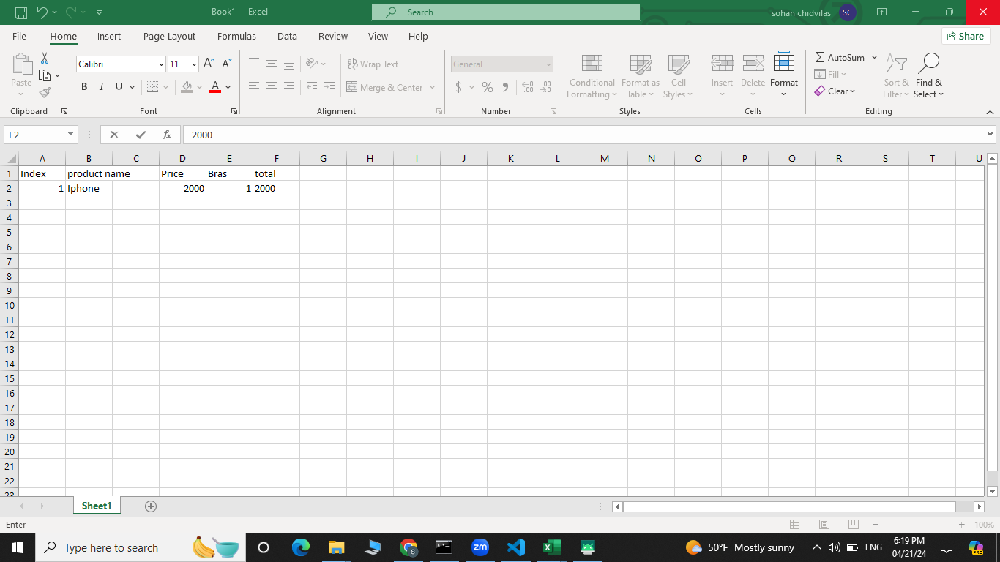

# Personal Mobile App Project Final

# Project Title: Invoice creator Along with CSV file.

# Team members

1. Sohan Chidvilas Bodapati, bodapass@mail.uc.edu

# Project Management Information

Project homepage (public): [https://github.com/sohanchidvilas/Personal-Mobile-App-Project-Final](https://github.com/sohanchidvilas/Personal-Mobile-App-Project-Final)

# Overview

The main aim of the app is to create a seamless application for the vendors who don't know how to create an invoice for their products this will be helpful for them to create an invoice of their own with the React native application. This application also creates a comma-separated value (CSV) of a tabular column present in the invoice to keep track of the products.

# Implementation
This little piece of code sets up a React Native application's basic navigation using the `@react-navigation/native} library. Let's dissect the functions of each component:

1. Statements of Import: 
   - "@react-navigation/native";`import { NavigationContainer }: This imports the `@react-navigation/native} package's `NavigationContainer` component. The component that controls the navigation tree and stores your application's navigation state is called `NavigationContainer`.

   - "@react-navigation/native-stack";`import {createNativeStackNavigator }: This imports the `@react-navigation/native-stack} package's `createNativeStackNavigator` function. You can use this function to make a stack navigator for your application.

2. Setup for Stack Navigator: - {const Stack = createNativeStackNavigator();}: Using the `createNativeStackNavigator` function that was previously imported, this builds a stack navigator. An instance of a stack navigator is now represented by the `Stack` variable.

3. Application Part:
   The method App() {... }} is exported by default. This outlines the primary element of the application.
   "Home" is the initial Route Name of {\Stack.Navigator> ... \/Stack.Navigator>}: This configures the stack navigator with "Home" as the first route name. You define the displays and their customisations within this navigator.
   -- }\Stack.This defines a screen called "Home" using the {Home} component as its content. Screen name="Home" component={Home} options={{ headerShown: false }} />}. The `options` prop is used to adjust the screen's behaviour, in this example, to hide the header.
   -- }\Stack.Another screen called "CreateBill" with the {CreateBill} component as its content is defined by this: screen name="CreateBill" component={CreateBill} />}.

4. App Component Exporting: - {export default function App() {... }}: Ultimately, this module's default export is the {App} component. This makes it possible for other application components to import and utilise the {App} component.

In general, this code establishes a fundamental navigation framework for your React

# Screenshots
Firstly the page is all about clicking on the create bill then it redirects to the form page to fill up. After creation of the form it will redirt to the PDF that has been created and it will be stored on the localhost and the PHP code of creation will be established. Finally, the PDF will be created.

